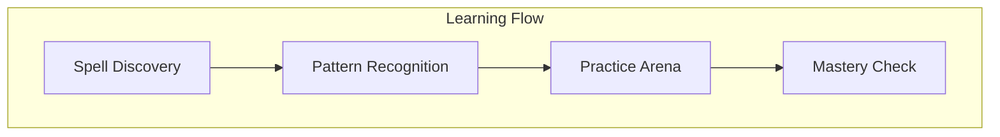

# The Universal Learning System 📚

## Core Components

### Schools of Magic
1. School of Elemental Data (Data Types)
2. School of Flow Magic (Control Flow)
3. School of Ritual Crafting (Functions)
4. School of Object Weaving (OOP)
5. School of Defensive Arts (Error Handling)

### Learning Mechanics
- Spells (Individual Skills/Concepts)
- Schools (Knowledge Domains)
- Masteries (Proficiency Levels)
- Combinations (Skill Interactions)
- Practice Rituals (Exercises)

### Progression System


## Safety System
- Prerequisites for advanced spells
- Warning systems for dangerous combinations
- Best practices as magical principles
- Debug/troubleshooting as spell diagnosis

## Implementation Guidelines
For Each Spell:
- Pattern (What it does)
- Components (How it works)
- Practice (How to use it)
- Mastery (How to verify learning)

## Structure Example:
```javascript
// ECHO spell (console.log)
// Pattern: Reveals the hidden essence of any value
// Components: console object, log method, value to reveal
// Practice: Echo different types of values
// Mastery: When you can inspect any value's true form
console.log("Hello, World");
```