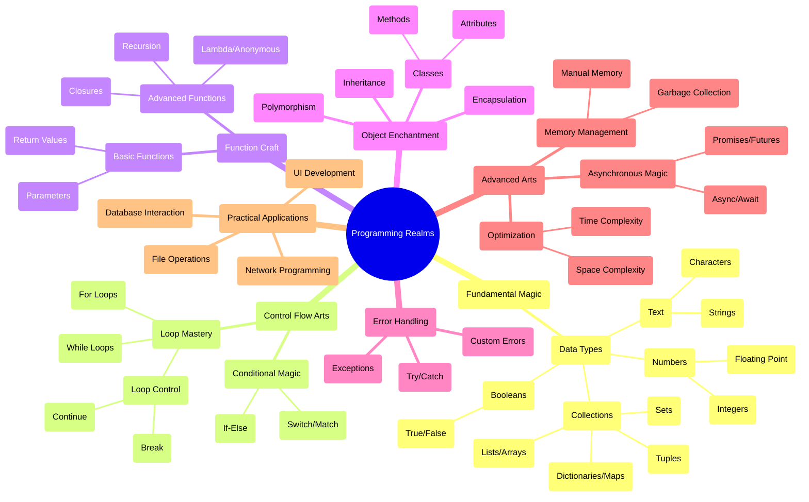

# The Realms of Programming Knowledge 🌌

```mermaid
mindmap
  root((Programming Realms))
    (Fundamental Magic)
      (Data Types)
        (Numbers)
          (Integers)
          (Floating Point)
        (Text)
          (Strings)
          (Characters)
        (Booleans)
          (True/False)
        (Collections)
          (Lists/Arrays)
          (Dictionaries/Maps)
          (Sets)
          (Tuples)
    (Control Flow Arts)
      (Conditional Magic)
        (If-Else)
        (Switch/Match)
      (Loop Mastery)
        (For Loops)
        (While Loops)
        (Loop Control)
          (Break)
          (Continue)
    (Function Craft)
      (Basic Functions)
        (Parameters)
        (Return Values)
      (Advanced Functions)
        (Lambda/Anonymous)
        (Recursion)
        (Closures)
    (Object Enchantment)
      (Classes)
        (Attributes)
        (Methods)
      (Inheritance)
      (Polymorphism)
      (Encapsulation)
    (Error Handling)
      (Try/Catch)
      (Exceptions)
      (Custom Errors)
    (Advanced Arts)
      (Asynchronous Magic)
        (Promises/Futures)
        (Async/Await)
      (Memory Management)
        (Garbage Collection)
        (Manual Memory)
      (Optimization)
        (Space Complexity)
        (Time Complexity)
    (Practical Applications)
      (File Operations)
      (Network Programming)
      (Database Interaction)
      (UI Development)
```