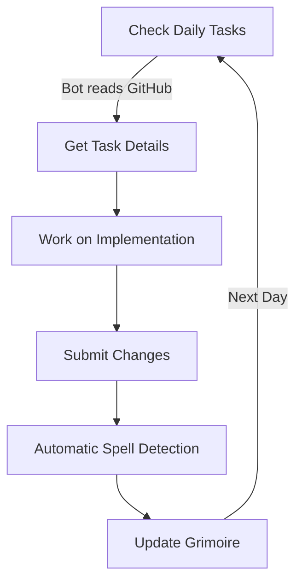

# SpellForge Learning Journey 🧙‍♂️

## Overview
SpellForge is a unique learning system where programming skills ("spells") are discovered and mastered through actual project implementation. Instead of learning concepts first, you discover them naturally through completing tasks.

## How It Works

### 1. Daily Learning Loop


### 2. Spell Discovery Process
When you complete a task, the system:
1. Analyzes your code changes
2. Identifies programming patterns used
3. Documents these as "spells" in your grimoire
4. Organizes them by "schools of magic"

### Example Journey

#### Starting a Task
```bash
# Ask your bot what's next
/next-task

# Bot responds with current task from GitHub:
"Task: Implement GitHub API integration
Expected spells: API Integration, Async Operations
Current progress: 0/3 objectives"
```

#### Implementation
You work on the task, naturally using concepts like:
- Async/await
- API calls
- Error handling

#### Completion
```bash
# When you complete the task
/task-complete

# System analyzes your code and responds:
"Spells Discovered:
- Async Magic (async/await patterns)
- API Binding (REST API integration)
- Error Warding (try/catch usage)

Added to your grimoire under 'Integration Magic'"
```

### Learning Through Building
The key difference in this approach:
1. You focus on building real features
2. System identifies what you've learned
3. Knowledge is organized after discovery
4. Learning is practical and contextual

## Getting Started
1. Start with your project goals
2. Let the bot guide daily tasks
3. Implement features naturally
4. Watch your grimoire grow

## Example Task Flow
Task: "Add GitHub API to Discord Bot"
- Implementation needed: GitHub API integration
- Natural learning: API authentication, async operations
- Discovered spells: API Integration Magic, Async Conjuring
- Documentation: Automatically added to Grimoire

Remember: Focus on building, let the learning emerge naturally!